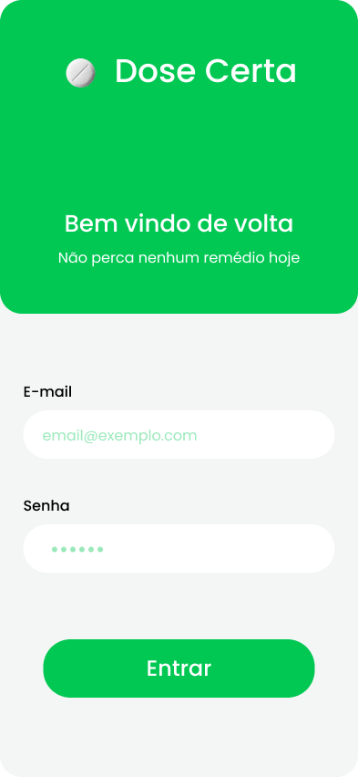
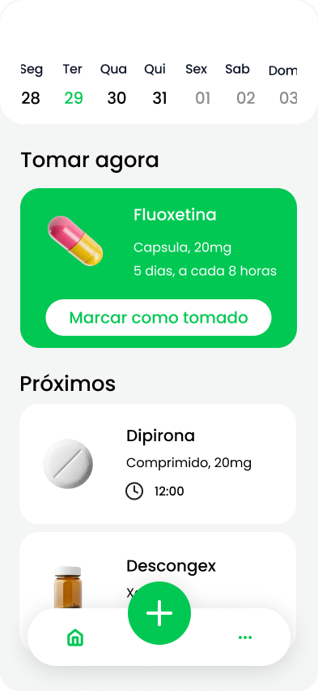
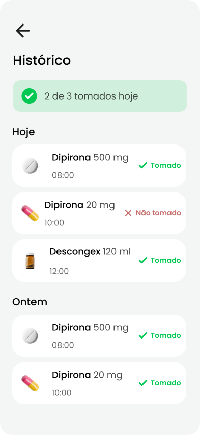
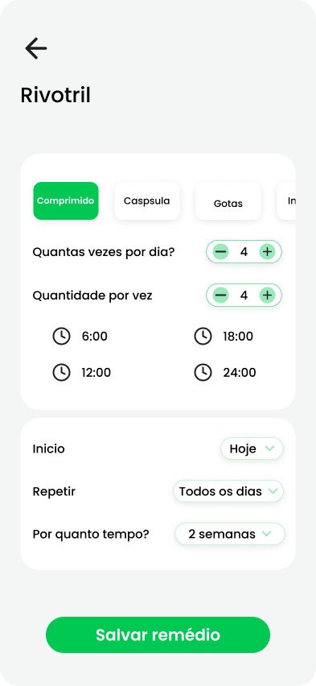

# 📝 Proposta de Projeto: Dose Certa

## 📋 Informações Básicas

### Nome do Projeto
`Dose Certa`

### Equipe
| Nome | GitHub | Papel Principal |
|------|--------|-----------------|
| Rayssa | [A Preencher] | Backend / Design |
| Cauan | [A Preencher] | Backend |
| Pedro | [A Preencher] | Frontend |
| Levi | [A Preencher] | Frontend |
| Nicollas | [A Preencher] | Banco de Dados |
| Luana | [A Preencher] | Banco de Dados |

---

## 🎯 Identificação do Problema

### 1. Descrição do Problema
Pacientes que tomam vários remédios todos os dias, especialmente os idosos, enfrentam grandes dificuldades para tomá-los nos horários corretos. Além do esquecimento no dia a dia, é muito comum o paciente ter um "branco" na memória durante as consultas médicas, dificultando a explicação sobre quais remédios está realmente tomando. A falta de um acompanhamento simples e organizado prejudica o tratamento e aumenta muito o risco de complicações graves de saúde e de internações no hospital.

### 2. Público-Alvo
- **Perfil:** Pacientes e idosos (ou seus cuidadores).
- **Necessidades específicas:** Lembretes claros, armazenamento do propósito do remédio (condição tratada) e histórico de uso para prestação de contas aos médicos.
- **Conhecimento tecnológico:** Iniciante/Intermediário (exige interface extremamente acessível).

---

## 💡 Solução Proposta

### 1. Descrição da Solução
O **Dose Certa** é um aplicativo de celular feito para ajudar as pessoas a tomarem seus remédios na hora certa, através de lembretes automáticos e de um histórico fácil de usar. O nosso grande diferencial é registrar não apenas *o que* tomar, mas *o motivo* (para que serve o remédio), organizando as dosagens e a duração do tratamento para facilitar a vida do paciente quando for conversar com o seu médico.

### 2. Funcionalidades Principais (MVP)
- [ ] **Autenticação:** Login seguro via Firebase Auth.
- [ ] **Cadastro de Medicamento:** Registro de Nome, Dosagem, Horário e Finalidade.
- [ ] **Listagem e Lembretes:** Dashboard mostrando os remédios diários.
- [ ] **Histórico:** Marcação de "Tomado".

---

## 🛠️ Especificações Técnicas

### 1. Stack Tecnológica
| Camada | Tecnologia | Justificativa |
|--------|------------|---------------|
| **Frontend** | React Native | Multiplataforma (iOS/Android), alta performance e ecossistema maduro. |
| **Backend** | Firebase (Cloud Functions/Auth) | Escalabilidade automática, BaaS rápido e confiável para times ágeis. |
| **Banco de Dados** | Firebase Firestore (NoSQL) | Sincronização em tempo real nativa, ideal para logs e histórico mobile. |

### 2. Requisitos Não-Funcionais
- **Performance:** App deve carregar listagem do dia em < 2s.
- **Segurança:** Dados sensíveis de saúde protegidos por regras de segurança do Firestore (RLS/Security Rules) e `.env` protegido.
- **Usabilidade:** Contraste amigável e botões grandes (Acessibilidade Tática).

---

## 📅 Planejamento Tático (12 Semanas)

### 🟢 PREPARAÇÃO
- **Semana 1-2:** Objetivo: começar perfeito (GitHub + planejamento)
  - [x] Repositório, Estruturas e Commits base.
  - [x] Wireframes (Tela de login, principal, cadastro, histórico).

### 🟡 PREPARAÇÃO TÉCNICA
- **Semana 3-4:** Objetivo: App rodando ("Hello World")
  - [x] Instalar ambiente (Node, Expo).
  - [x] Firebase: Configurar Firestore e Auth e conectar.

### 🔵 MVP (NÚCLEO DO SISTEMA)
- **Semana 5:** Objetivo: Lógica de Login e Cadastro (Firebase Auth)
  - [x] Implementar Interface de Login (Figma style).
  - [x] Conectar Firebase Auth (Login/Cadastro).
- **Semana 6:** Objetivo: Cadastro de medicamentos no Firestore.
  - [x] Criar formulário de medicamentos (Nome, Dosagem, Horário).
  - [x] Implementar função de escrita no Firestore.
- **Semana 7:** Objetivo: Listagem dos medicamentos (Dashboard).
  - [/] Implementar leitura em tempo real dos remédios do dia.
  - [ ] Criar interface de cards para visualização clara.
- **Semana 8:** Objetivo: Fechamento MVP (Histórico e Ações).
  - [ ] Implementar botão de "Tomado" (Check-in).
  - [ ] Salvar registros de histórico em nova coleção no Firestore.

### 🟣 REFINAMENTO E ADICIONAIS
- **Semana 9-10:** UX/UI e Lembretes
  - [ ] Adicionar ícone de "olhinho" 👁️ para visualizar/ocultar senha no login.
  - [ ] Implementar botão de "Esqueci minha senha" com `sendPasswordResetEmail`.
  - [ ] Estilizar os templates de e-mail do Firebase (Confirmação e Redefinição de Senha).
  - [ ] Push notifications simuladas e validações visuais.
  - [ ] Calendário interativo: clicar em dias passados/futuros para ver remédios tomados ou programados.
  - [ ] **Pixel Perfect:** Criar `DayComponent` customizado no calendário para que o nome do dia também fique verde ao ser selecionado.
- **Semana 11:** Profissionalismo (Caça aos Bugs)
  - [ ] 🐛 **Bug #1:** Tratar erro `auth/invalid-credential` separando "e-mail não existe" de "senha incorreta" usando `fetchSignInMethodsForEmail`.
  - [ ] 🐛 **Bug #2:** Sincronizar Firebase Auth e Firestore — Se o documento do usuário não existir no Firestore ao logar, recriá-lo automaticamente via `setDoc`.
  - [ ] 🐛 **Bug #3:** Tratar erro `auth/network-request-failed` alertando o usuário sobre a falta de conexão de internet de forma clara e amigável em vez de exibir a mensagem genérica de erro.
  - [ ] 🛡️ **Segurança:** Realizar auditoria de dependências (`npm audit fix`) e resolver vulnerabilidades críticas.
  - [ ] Code review da pasta `services/` e documentação final no README.
- **Semana 12:** Apresentação (Pitch do Problema -> Solução -> Demo Real).

---

## 🖼️ Protótipo (Wireframes)

Para garantir a melhor experiência do usuário e acessibilidade, os seguintes wireframes foram desenhados:

### 1. Login e Autenticação

### 2. Dashboard Principal

### 3. Histórico de Medicamentos

### 4. Cadastro de Novo Medicamento

---

## 📊 Métricas de Sucesso

- [ ] Todas as 4 fases do MVP rodando sem crashes.
- [ ] Segurança confirmada (Nenhuma variável de ambiente vazada).
- [ ] Código versionado com commits profissionais (Semânticos, separados por contexto arquitetural).

---

## 🔒 Considerações de Segurança

- [x] Arquivos `.env` ignorados no `.gitignore`.
- [ ] Firebase Rules fechadas para impedir acesso não autenticado a dados de saúde de terceiros.
